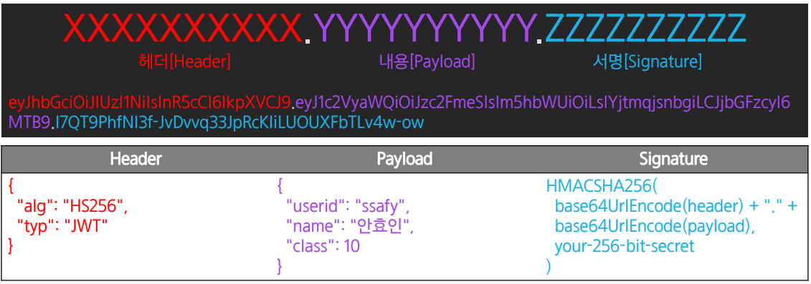
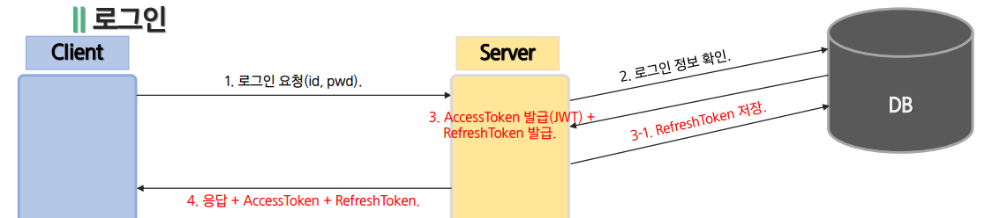
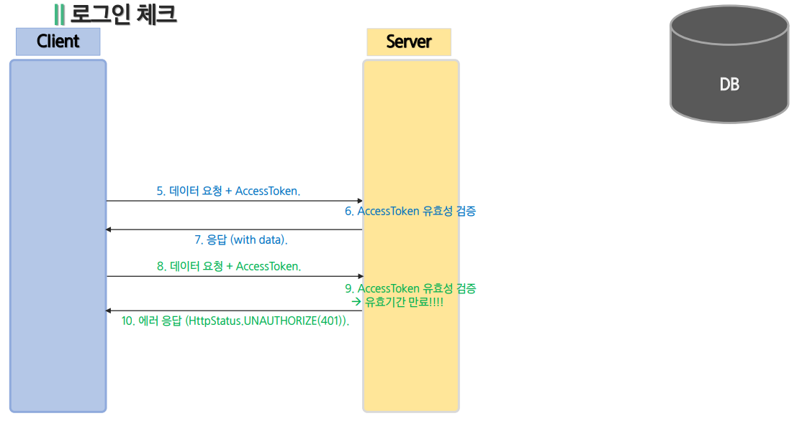

# JWT

<pre>
JSON Web Token
두 개체 사이에서 JSON 객체를 사용하여 가볍고 자가수용적인 방식으로 정보를 안전하게 전달해주는 웹 표준 인증 방식
</pre>

### 구성요소

* Header, Payload, Signature 세 부분으로 구성되어 있다.

### 헤더(Header)
* 헤더는 typ과 alg 두 가지의 정보를 지니고 있다.
* typ: 토큰의 타입을 지정
* alg: 해싱 알고리즘을 지정

### 정보(payload)
* 토큰을 담을 정보가 들어있다. 정보의 한 조각을 클레임(claim)이라고 부르고 이는 key / value 쌍으로 이뤄져있다.
* 토큰에는 여러 개의 클레임을 넣을 수 있지만 그 경우 토큰의 길이가 길어진다.
* payload에는 민감한 정보를 넣으면 안 된다.

#### 클레임의 종류
1. 등록된 클레임
* 토큰에 대한 정보들을 담기위해 이름이 이미 정해진 클레임
* 등록된 클레임의 사용은 선택적이다.
2. 공개 클레임
* 공개 클레임들은 충돌이 방지된 이름을 가지고 있어야 한다.
* 충돌을 방지하기 위해 클레임 이름을 URI형식으로 짓는다.
3. 비공개 클레임
* 등록된 클레임도 아니고 공개된 클레임도 아니다.
* 보통 클라이언트와 서버 합의하에 사용되는 클레임 이름들이다. 충돌이 일어날 수 있으니 사용 시 주의해야 한다.

### 서명(Signature)
* 헤더의 인코딩값과 정보의 인코딩값을 합친후 주어진 비밀키로 해쉬를 하여 생성한다. 이렇게 만든 해쉬를 base64 형태로 나타낸다.
* 서버의 개인키를 포함하여 암호화하는 토큰의 유효성을 검증하기 위한 문자열로 구성된다.

### Access Token & Refresh Token
* 두 토큰 모두 JWT이다.
* 보통 Access Token의 유효기간을 짧게 하고 Refresh Token을 이보다 길게 한다.
  

* 클라이언트가 로그인 시도 시 정보가 유효하다면 두 토큰 모두 발급 해준다.
  * 이 때 Refresh Token을 DB에 저장한다.

* Access Token의 유효기간이 다 했을 때 Refresh Token을 이용해 새롭게 발급한다.
* Refresh Token의 유효기간까지 다 했다면 사용자는 새로 로그인해서 이를 새롭게 발급받아야 한다.

