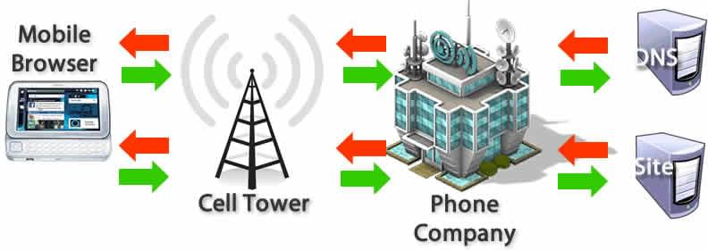

# 브라우저 동작 방식

### 브라우저 주요 기능
* `사용자가 선택한 자원`을 `서버에 요청(Request)`하고 응답(Response)를 받아 `브라우저에 표시`한다.
* 자원은 보통 HTML 문서지만 PDF나 이미지 또는 다른 형태일 수도 있다.
  * 자원의 주소는 `URI`(Uniform Resource Identifier)에 의해 정해진다.

### 자원의 종류에 따른 처리 엔진
* HTML, CSS
  * `렌더링 엔진의 HTML 파서와 CSS 파서에 의해 파싱(Parsing)`되어 DOM, CSSOM 트리로 변환되고 `렌더 트리로 결합`된다.
  * 이렇게 생성된 렌더 트리를 기반으로 브라우저는 웹페이지를 표시한다.
* JavaScript
  * `자바스크립트는 자바스크립트 엔진이 처리`한다. 
  * HTML 파서는 script 태그를 만나면 자바스크립트 코드를 실행하기 위해 DOM 생성 프로세스를 중지하고 자바스크립트 엔진으로 제어 권한을 넘긴다.
  * 제어 권한을 받은 자바스크립트 엔진은 script 태그내의 자바스크립트 코드 또는 script 태그의 src 어트리뷰트에 정의된 자바스크립트 파일을 로드하고 파싱하여 실행한다.
  * 자바스크립트의 실행이 완료되면 다시 HTML 파서로 제어 권한을 넘겨서 브라우저가 중지했던 시점부터 DOM 생성을 재개한다.

### 브라우저의 성능과 지연시간
* 사용자는 `로드가 빠르고 상호작용이 원활`한 컨텐츠로 이뤄진 웹 경험을 원한다.
* 따라서 대다수의 브라우저는 `싱글 쓰레드`이다.

## 브라우저의 동작 과정
### 탐색(Navigation)
   * 탐색(Navigation)은 웹페이지를 로딩하는 첫 단계이다. 사용자가 주소창에 `URL을 입력`하거나, `링크를 클릭`하고, `폼(form)을 제출`하는 등의 동작을 통해 요청을 보낼 때마다 발생한다.
   * `웹 최적화의 목표 중 하나는 탐색이 완료될 때까지의 시간을 최소화 하는 것`이다. 이상적인 조건에서 그다지 오래 걸리는 작업이 아니지만 지연시간과 대역폭은 지연을 일으키는 적이다.
1. DNS 조회 (DNS Lookup)
   * 탐색하려는 페이지의 자원이 어디에 위치하는지 찾는 것
     * 한 번도 방문한 적이 없을 경우 - DNS 조회를 실행, 네임 서버는 IP 주소로 응답한다. 
     응답하고 나서는 일정 시간동안 IP가 캐시된다. 
     * 방문한 적이 있을 경우 - 캐싱된 IP를 얻어온다.
   * DNS 조회는 호스트 이름 하나 당 한 번만 수행된다.
     * 하지만 요청된 페이지에서 참조하는 다른 호스트 이름에 대해서 각각 수행되기 때문에 성능 저하를 야기한다. -> 특히 모바일 환경에서 각각의 DNS 조회 과정에 셀타워와 통신사를 거쳐야 하기 때문에 심하다.
     

2. TCP 핸드셰이크 (TCP Handshake)
   * IP 주소를 알고난 후에는 3-way 핸드셰이크를 통해 연결을 설정한다.
   * 데이터를 주고 받기 전, 통신하려는 두 주체가 TCP 소켓 연결을 위한 매개변수를 주고 받는다.
   * 두 주체가 TCP 세션을 협상하고 시작하기 위해서 TCP가 SYN, SYN-ACK, ACK 3개의 메세지를 전달한다.

3. TLS 협상 (TLS Negotiation)
...
============= 폐기 ===============

# 브라우저 동작 방식

## 브라우저란?
* 사용자가 선택한 자원을 서버에 요청하고 표시해주는 것
* 자원은 보통 HTML 문서지만 PDF나 이미지 또는 다른 형태일 수도 있다.
  * 자원의 주소는 `URI`(Uniform Resource Identifier)에 의해 정해진다.
  * 브라우저는 html과 css 명세에 따라 html 파일을 해석해서 표시함

## 브라우저의 구성 요소

### 사용자 인터페이스 
* 주소표시줄, 이전/다음 버튼, 북마크 메뉴 등 요청한 페이지를 보여주는 창을 제외한 나머지 모든 부분
### 브라우저 엔진 
* 사용자 인터페이스와 렌더링 엔진 사이의 동작을 제어
### 렌더링 엔진 
- 요청한 콘텐츠를 표시. 예를 들어 HTML을 요청하면 HTML과 CSS를 파싱하여 화면에 표시
### 통신 
- HTTP 요청과 같은 네트워크 호출에 사용됨. 이것은 플랫폼 독립적인 인터페이스이고 각 플랫폼 하부에서 실행됨
### UI 백엔드 
- 콤보 박스와 창 같은 기본적인 장치를 그림. 플랫폼에서 명시하지 않은 일반적인 인터페이스로서, OS 사용자 인터페이스 체계를 사용
### 자바스크립트 해석기 
- 자바스크립트 코드를 해석하고 실행
### 자료 저장소 
- 이 부분은 자료를 저장하는 계층이다. 쿠키를 저장하는 것과 같이 모든 종류의 자원을 하드 디스크에 저장할 필요가 있다.

## 렌더링이란?
* 렌더링 엔진은 요청 받은 내용을 브라우저 화면에 표시한다.
* 기본적으로 html, xml 문서와 이미를 표시해준다.
* 추가로 플러그인이나 브라우저 확장 기능으로 pdf 같은 다른 유형도 표시할 수 있다.
### 렌더링 엔진 종류
* 크롬, 사파리 : 웹킷(Webkit) 엔진 사용
* 파이어폭스 : 게코(Gecko) 엔진 사용   

`웹킷(Webkit)` : 최초 리눅스 플랫폼에 동작하기 위한 오픈소스 엔진 (애플이 맥과 윈도우에서 사파리 브라우저를 지원하기 위해 수정을 더했음)

## 렌더링 동작 과정

### DOM 트리란?

* 문서 객체 모델(Document Object Model)
* HTML 문서에 접근하기 위한 일종의 인터페이스
* 문서 내의 모든 요소를 정의하고 각각의 요소에 접근하는 방법을 제공한다.

### 렌더 트리란?

* 화면에 보이는 모든 노드와 컨텐츠, 스타일 정보를 병합한 최종 출력을 뜻한다.
* 생성 과정
  1. 브라우저는 DOM 트리의 루트부터 각 노드들을 읽으며 표시한다.
  2. 표시된 각 노드에 대한 적절한 CSSOM 규칙을 찾아 적용한다.
  3. 표시된 노드를 컨텐츠 및 계산된 스타일과 함께 내보낸다.
## 브라우저 동작 과정
1. 주소창에 URL 입력 -> 서버에 요청이 전송
2. 해당 페이지에 존재하는 자원들에 DNS 조회를 하고 IP를 받는다.
3. 브라우저는 렌더링 엔진을 통해 해당 자원이 담긴 html과 스타일이 담긴 css를 W3C 명세에 따라 해석한다.
4. 렌더링 엔진은 `html 파서를 통해 html 파싱 과정`을 시작한다. html 파서가 문서에 존재하는 어휘와 구문을 분석하면서 `DOM 트리를 구축`한다.
   * 이 과정에서 <script> 태그를 만나면 자바스크립트 엔진에 제어 권한을 넘기고 정의된 자바스크립트 파일을 로드하고 파싱하고 실행한다.
   * 자바스크립트의 실행이 완료되면 다시 HTML 파서로 제어 권한을 넘겨서 브라우저가 중지했던 시점부터 DOM 생성을 재개한다.
5. 그 다음 렌더링 엔진은 `css 파서를 통해 모든 css 정보를 스타일 구조체(CSSOM)로 생성`한다.
6. 브라우저는 `DOM과 CSSOM을 연결해서 렌더트리를 생성`한다.
7. 화면에 배치를 시작하고 , UI 백엔드는 노드를 돌며 형상을 그린다.
8. 이 때 배치와 그리는 과정은 페이지 정보를 모두 받고 한꺼번에 진행되지 않음. 자원을 전송받으면, 기다리는 동시에 일부분 먼저 진행하고 화면에 표시

## References
[Naver D2](https://d2.naver.com/helloworld/59361) 
[Poiema Web](https://poiemaweb.com/js-browser) 
[mdn web docs](https://developer.mozilla.org/ko/docs/Web/Performance/How_browsers_work)