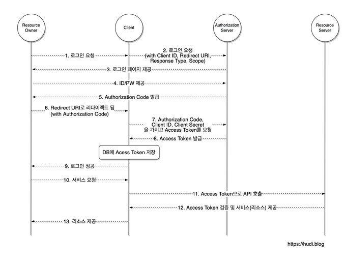

# 인증 방식

### API Key
* 서비스들이 거대해지면서 기능들을 분리하고 모듈화하기 시작했는데 모듈이나 애플리케이션간 `독립성을 보장`하기 위해 등장한 기술중 가장 보편적으로 쓰인다.

### 동작 방식
1. 사용자는 `API Key를 발급`받는다.
2. 해당 API를 사용하기 위해 `Key와 함께 요청`을 보낸다.
3. 애플리케이션은 요청이 오면 Key를 통해 User정보를 확인하여 `누구의 Key인지 권한이 무엇인지를 확인`한다.
4. 해당 Key의 `인증과 인가`에 따라 데이터를 사용자에게 반환한다.

### 문제점
* API Key를 사용자에게 직접 발급하고 해당 Key를 통해 통신을 하기 때문에 통신구간이 암호화가 잘 되어 있더라도 `Key가 유출되면 대비하기 힘들다`.
* 그렇기 때문에 주기적으로 `Key를 업데이트` 해야해서 번거롭고 예기치 못한 상황(한쪽만 업데이트가 실행되어 매치가 안되는 등)이 발생할 수 있다.
* Key 한 가지로 정보를 제어하기 때문에 `보안문제가 발생`하기 쉽다.

## OAuth2
* API Key의 단점을 메꾸기 위해 등장했다. 요청하고 요청받는 단순한 방식이 아닌 인증하는 부분이 추가되어 독립적으로 세분화되었다.

### 동작 방식

1. 사용자가 애플리케이션의 기능을 사용하기 위한 `요청`을 보낸다.
2. 애플리케이션은 해당 사용자가 로그인 되어 있는지를 확인한다. 로그인 되어 있지 않다면 다음 단계로 넘어간다.
   *  애플리케이션은 사용자가 로그인되어 있지 않으면 사용자를 `인증서버로 Redirection`한다.
   * 간접적으로 Authorize 요청을 받은 인증서버는 해당 사용자가 회원인지 그리고 인증서버에 `로그인 되어 있는지를 확인`한다.
3. 인증을 거치면 사용자가 `최초의 요청에 대한 권한`이 있는지를 확인한다.
이 과정을 `Grant`라고 한다.   

**Grant?**
> Grant는 인가와는 다른 개념이다. 인가는 서비스 제공자 입장에서 사용자의 권한을 보는 것이지만, Grant는 사용자가 자신의 인증정보(보통 개인정보에 해당하는 이름, 이메일 등)를 Application에 넘길지 말지 결정하는 과정이다.

4. 사용자가 `Grant요청`을 받게되면 사용자는 해당 인증정보에 대한 `허가`를 내려준다. 해당 요청을 통해 `다시 인증서버에 인가 처리를 위해 요청`을 보낸다.
5. 인증서버에서 인증과 인가에 대한 과정이 모두 완료되면 `Application에게 인가코드를 전달`한다. `인증서버는 해당 인가코드를 자신의 저장소에 저장`한다. 해당 코드는 보안을 위해 짧은 기간동안만 유효하다.
6. 인가 코드는 짧은 시간 유지되기 때문에 애플리케이션은 `해당 코드를 Request Token으로 사용하여 인증서버에 요청`을 보낸다.
7. 해당 Request Token을 받은 인증서버는 자신의 저장소에 저장한 코드와 `일치하는지 확인`하고 긴 유효기간을 가진 리소스 접근에 사용되는 `Access Token을 Application에게 전달`한다.
8. 애플리케이션은 이 `Access Token을 통해 업무를 처리`한다. 해당 Access Token을 통해 리소스 서버에 요청을 하게 된다. `매 접근마다 인증서버에 연결하여 토큰의 유효성을 확인`한다.

### 문제점
* 기존 `API Key에 비해 복잡`하다
* 무의미한 문자열을 가지고 정해진 규칙이없기 때문에 `증명확인이 필요`하다.
* `인증서버에 어떤 식의 접근이든 유효성 확인 작업이 필요`하다.

## JWT
* JWT는 JSON Web Token의 줄임말로 인증 흐름의 규약이 아닌 Token 작성에 대한 규약이다. 기본적인 Access Token은 의미가 없는 문자열로 이루어져 있어 Token의 진위나 유효성을 매번 확인해야 하는 것임에 반하여, JWT는 `인증여부 확인을 위한 값`, `유효성 검증을 위한 값` 그리고 `인증 정보 자체`를 담고 있기 때문에 `인증서버에 접근하지 않아도 된다는 장점`이 있다.

### 문제점
* 서버에 직접 연결하여 인증을 하지 않기 때문에 장점들이 많지만 반대로 `민감한 정보들은 저장되어 있지 않기 때문에 다시 접속하는 과정이 필요`하다.
